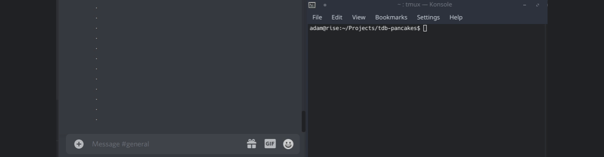

# tdb-pancakes

Auto-responder for Pancake bot written in Python 3.

# Deprecation notice!

This project was a quick turn-around project. One of the libraries this project uses, Discord.py, has been discontinued. I'm not too interested in maintaining this project even from its beginning. Therefore, this project will no longer be updated to ensure that it works with Discord.

## Dependencies

* html
* bs4
* requests
* discord.py

## Components

tdb-pancakes consists of two separate components, the Q/A scrapper and the Discord interactor.

### Scrapper/Indexer

The Pancake bot uses OpenTDB to obtain its list of questions and answers (Q/A).
While OpenTDB provides an API to retrieve Q/A, it is limited to only obtain a random
set from what is available in its entire DB. This means we can't just simply query the API
for a specific question and retrieve the answer.

To solve this, a scrapper is needed to record every Q/A. The current implementation provides a
solution, by querying the API to get these random Q/A and checking it if it already exists in 
the database. If it doesn't, it will create a new entry.

In addition, we are also able to obtain the question ID through other methods; the API also doesn't
provide the ID, but the frontend does. The current implementation is able to retrieve the ID by using
the search feature in the frontend and entering it into the DB.

Note that the scrapper is considerate and delays each request.
Currently, the indexer only stores the ID, question, and correct answer of hard
questions.

### Bot

The scripts will be marked as tdb_*.py, where the wildcard is replaced with
their respective command. You'll have to get your user token and channel ID through
Discord in order to set it up. Look up online to see how to obtain these two
pieces of information.

Note that the files do not execute automatically. If you want automated use, you should
use your OS task scheduler (i.e. cron) to set up automated use.

* tdb_trivia automatically answers the trivia questions. You'll need to populate
your database first in order to use it. The script is barebones at the moment
and needs to be improved, but it works if the question is in the DB and the bot
gives out the right reply.

* tdb_daily is very simple, just say p!daily at the selected channel.

## TODO

Core functionality is finished, but the following still needs to be addressed

* Exception handling
* Code clean-up/readability

## Disclaimer

Discord disallows bots that are using user accounts. Your account
might get banned for using this script.

This script is licensed under the MIT license.
